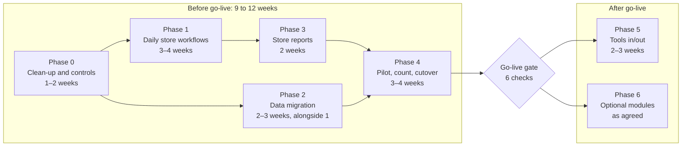

# Afrinov Inventory Platform: Workbook Replacement Roadmap

Oct 8, 2026 · Sbonakaliso Ngcobo

## Summary

The platform can replace the stock workbook (AFRI-03A-08-IAM-02 - Stock Inventory1.xlsm) at the end of Phase 4, about 9 to 12 weeks from the start. Phases 0 to 4 are what it takes for the store to stop using Excel. The foundation is already stronger than the workbook. The gaps are in the store's daily routine and in getting the data across.

- **Already better than the sheet:** stock worked out from a permanent transaction history, one item list instead of four copies, a proper location list, logins with the user recorded on every entry, an audit log that can't be edited, valuation and exports.
- **Blocking go-live:** there's no direct way to receive stock without enabling procurement, "Issued To" isn't captured, and there's no way to load the workbook's data.
- **Needs to change or go:** an endpoint that rewrites who posted a transaction, negative stock being a setting, settings that do nothing, self-signup, and a purchase-order flow built for courier shipments.

The go-live line sits after Phase 4. Phases 5 and 6 add tools tracking and optional modules once the store is running on the platform.

## How the workbook works today

The workbook is a formula-driven stock ledger: 31 sheets (17 hidden), about 920 stock lines, and roughly R644,000 in stock value excluding VAT. It has almost no VBA. The only macro locks every filled cell in the Consumables issue log so entries can't be edited later.

### The four stock categories

Each category uses the same four sheets:

1. **Main (item list):** Product ID, item name, location, Brought Forward, IN, OUT, Required Stock. Current stock = Brought Forward + IN − OUT, where IN and OUT are totals summed from the category's issue log.
2. **Issued (the log):** one row per movement. The storeman picks the item and IN or OUT, and enters the quantity, supplier and delivery/invoice number (for IN), Issued By (a dropdown of storemen), Issued To, and Project No. The rack and current stock fill in automatically.
3. **Stock Summary:** unit price excluding VAT, stock value, stock as a % of required, a re-order quantity (required − current), and an urgency flag: URGENT below 20%, WARNING below 40%, OK otherwise.
4. **Stock Report (hidden):** quantity used × unit price, which gives the value consumed in the period.

| Category | Stock lines | Stock value (R, excl. VAT) | Lines with no Required Stock |
| --- | --- | --- | --- |
| Consumables | 425 | 239,980 | 222 |
| Tooling, PPE & Electrical | 248 | 122,999 | 190 |
| Project Material | 48 | 208,677 | 48 |
| Fasteners, Slugs & Insulation | 200 | 72,213 | 118 |

### Period rollover

All four issue logs are empty right now and current stock sits in Brought Forward. That suggests someone periodically copies current stock into Brought Forward and clears the log. This is read from the data; nobody has confirmed it yet.

### Side registers (mostly hidden)

- **Tools check-out/check-in:** 453 tools, many with serial numbers, with Check Out, Check In and Scrapped statuses. The last entry is from January 2026.
- **Consumable Box:** individual grinding and cutting discs issued to named workers and marked Finished or Broken. It was used in October 2025 only.
- **Office Device List:** a fixed-asset register of laptops, monitors and furniture, with serial number, assignee, insured flag and value.
- **Scrap Material:** scrap sold, in kg per metal and in rands.
- **Employees:** the Issued To list. It mixes workers with clients (Northam, Samancor), machines (Forklift, Generator) and contractors.
- **Project No.:** 21 project codes and names.
- **Dashboard:** a pivot-based summary that is out of date.

### Defects in the workbook

- **Urgency formulas:** in the Fasteners and Project summaries they're written `0.2>H5<0.4`, which doesn't test the 20–40% band. Fasteners shows #N/A or blank for 108 of its 200 rows.
- **Project Material:** the "% In Stock" formula is broken (`F4E4`), and Required Stock is blank, so 46 of 48 lines show URGENT.
- **Unit prices** live on the Summary sheets and are matched to items only by row position. Sorting or inserting a row on a Main sheet attaches the wrong price to every item below it.
- **Product IDs:** 77 are duplicated in Consumables and 30 in Fasteners, and the same IDs are reused across categories (e.g. P-036 to P-056).
- **Locations:** about 50 spellings in Consumables alone ("Stores", "stores", "STORES", "Store room", ...).
- **Broken references:** the S.N column shows #REF!, and so does the Fasteners Stock Report total.
- **Password:** the sheet-protection password sits in plain text in the macro.

## What the platform covers today

The platform fully covers 7 of the workbook's 16 workflows, covers 3 in part, and is missing 6. Two of the missing ones, receiving stock and Issued To, happen every day.

| Workbook workflow | Platform today | Status | Phase |
| --- | --- | --- | --- |
| Item list with four categories | `Material` with a category field (same four, plus TOOLS) | Covered | — |
| Current stock = BF + IN − OUT | Balances worked out from the transaction history | Covered, better than the sheet | — |
| Log locked by macro | Ledger you can only add to, plus audit log | Covered, better than the sheet | 0 (remove the edit endpoint) |
| Issued By | Logged-in user recorded on every entry | Covered | 4 (storemen need accounts) |
| Rack / location | Location and rack lists | Covered | 2 (map 50 spellings) |
| Valuation (unit price × qty) | `unitCost` and inventory value in the report | Covered | 2 (load prices) |
| Projects | Project list, project linked to each issue | Covered | 1 (dropdown on the issue form) |
| OUT (issue) | Issue action on the Stock page | Partly: project is free text, no recipient | 1 |
| Re-order quantity and urgency bands | LOW / not LOW only | Partly | 3 |
| Value of stock used | Project consumption in quantities only | Partly | 3 |
| **IN (receive) with supplier and invoice no.** | Only through goods receipts, which are switched off with procurement | Missing | 1 |
| **Issued To** | Must be a user who logs in, and the form doesn't ask | Missing | 1 |
| **Loading the workbook's data** | No importer | Missing | 2 |
| Tools check-out / check-in | Permissions exist, nothing else | Missing | 5 |
| Consumable Box (per-worker accountability) | Nothing yet; becomes possible once Issued To exists | Missing | 1 (recipients), 3 (report) |
| Office devices, scrap sales | Nothing | Missing, scope to decide | 6 |

## What to keep, change, remove and add

Keep the core design. Change seven things: three gaps in the daily workflows, two weakened controls, and two reports. Remove what models a bigger business than Afrinov's store. Add the missing daily workflows.

### Keep

| What | Why it beats the workbook |
| --- | --- |
| Stock worked out from a permanent transaction history (ADR-002) | Fixes the sheet's root weakness: a log that is cleared each period, and balances that can drift |
| One item list with a category field | Replaces four copies of the same sheet layout |
| Location and rack lists | Replaces about 50 spellings of "Stores" |
| Logins, roles, user recorded on every entry | Replaces the Issued By dropdown and a shared sheet password |
| Audit log that can't be edited | Replaces a cell-locking macro that anyone with the password can undo |
| Valuation, low-stock report, Excel/PDF export | Replaces the Summary and Stock Report sheets |
| Transfers between locations | The sheet has none; today moves are lost or logged as an OUT plus an IN |
| Adjustments with a required reason | Replaces silent edits to Brought Forward |

### Change

| Change | Why | Where |
| --- | --- | --- |
| Add a direct "Receive stock" action (supplier, invoice/delivery no., location, lines) that works with procurement off | The workbook's most frequent entry is impossible today | Stock page; reuse goods receipts, which already allow no purchase order |
| Point `recipientId` at a recipients list of people and places who don't log in, and add it to the issue form | Workers, machines, sites and contractors receive stock; none of them are users | `inventory.service.ts`, `StockActionForm.tsx` |
| Turn project on the issue form into a dropdown | Free text breaks the project consumption report | `StockActionForm.tsx` |
| Remove `PATCH /inventory-transactions/:id` (changes who posted an entry); correct mistakes with a reversing entry | Rewriting history undermines the ledger | `inventory.routes.ts`, `TransactionDrawer.tsx` |
| Make "no negative stock" a fixed rule, not the `inventory.enableNegativeStockPrevention` setting | The sheet already has items below zero; this is what the platform fixes | `inventory.service.ts`, settings |
| Replace `lowStockMultiplier` with URGENT/WARNING/OK bands and a re-order quantity | Matches how the store reads stock today | Reporting service and pages |
| Add rand values to the consumption report, by project and by date range | The Stock Report sheet gives this today | `reporting.service.ts` |

### Remove (or hide until the business asks for it)

| Remove | Why |
| --- | --- |
| Settings that are read nowhere but the settings page: `security.enableAuditLogging`, `inventory.requireApprovalForSensitiveChanges`, `inventory.requireReasonForAdjustments`, `general.defaultLanguage`, `general.defaultTimezone`, `purchaseOrders.numberingFormat`, `notifications.enableDeliveryNotifications` | A toggle that does nothing misleads the admin. The first two are actively misleading (audit can't be turned off; no approval exists) |
| Purchase-order SHIPPED stage (carrier, tracking number) and 6 leftover statuses (SUBMITTED, SENT, PARTIALLY_RECEIVED, FULLY_RECEIVED, CLOSED, REJECTED) | Local suppliers deliver with an invoice. Target flow: Draft → Approved → Received (part or full) → Closed |
| Self-signup: `/auth/register`, the Signup page, `security.allowSelfRegistration` | Internal system; the admin creates accounts |
| Location address and contact fields, rack capacity and FULL status (hide from forms; keep the columns) | The store's locations are "A-1", "Stores", "Upstairs" |
| Demo login and mock data in production builds | A production build must refuse to start with `VITE_FRONTEND_ONLY` or `VITE_DEMO_AUTH_ENABLED` set |
| About 15 old audit and report markdown files at the repo root and in `afrinov-platform/` | Several are out of date (`CURRENT-STATE.md` still says there are no commits or CI) |

### Add

| Add | Why | Phase |
| --- | --- | --- |
| Recipients list (workers, machines, sites, contractors) | Issued To and per-worker accountability | 1 |
| Workbook importer with a mapping step | Nothing can go live without opening balances | 2 |
| Tools check-out / check-in with "who has it now" | The sheet tracks it; permissions already exist | 5 |
| Stock count (count sheet, variances posted as adjustments) | Sets opening balances at go-live and replaces period rollover | 2 and 4 |
| Production deployment, backups, monitoring | No live environment exists yet | 4 |

## Roadmap

Seven phases, numbered 0 to 6, take the store from the workbook to the platform, with go-live at the end of Phase 4, about 9 to 12 weeks from the start. The estimates assume one to two developers. Phases 1 and 2 can run side by side, and so can Phase 3 once Phase 1's data model is settled.

Phases 1 and 2 run side by side after the clean-up; reports follow Phase 1; nothing after the gate starts until the store is live.

| Phase | Goal | Estimate | Depends on |
| --- | --- | --- | --- |
| 0. Clean-up and controls | Remove what weakens the ledger or misleads users | 1–2 weeks | — |
| 1. Daily store workflows | A storeman can receive and issue everything the sheet handles | 3–4 weeks | 0 |
| 2. Data migration | Load items, prices, locations and opening balances from the workbook | 2–3 weeks (alongside 1) | 1's recipients and units |
| 3. Reporting the store already reads | Urgency bands, re-order quantity, value consumed | 2 weeks | 1 |
| 4. Pilot and go-live | Production environment, training, parallel run, cutover | 3–4 weeks | 1, 2, 3 |
| 5. Tools check-out / check-in | Know who holds each tool | 2–3 weeks | 4 |
| 6. Optional modules | Procurement, alerts, assets, scrap, labels | As agreed | 4 |

### Phase 0: Clean-up and controls

This phase is small and best done before real data exists.

- [x] Remove `PATCH /inventory-transactions/:id`, `InventoryService.updateActor` and the edit option in `TransactionDrawer.tsx`; add a reversing-entry action for mistakes
- [x] Make "no negative stock" a fixed rule for issues, transfers and adjustments; delete `inventory.enableNegativeStockPrevention`
- [x] Delete the seven settings that do nothing (listed in Remove), or wire up any the business wants
- [x] Remove `/auth/register`, the Signup page and `security.allowSelfRegistration`
- [x] Cut purchase-order statuses down to Draft, Pending approval, Approved, Partly received, Received, Closed, Cancelled; drop the SHIPPED stage fields from the UI
- [x] Make production builds fail if `VITE_FRONTEND_ONLY` or `VITE_DEMO_AUTH_ENABLED` is set
- [x] Hide location address and contact fields and rack capacity and FULL status from forms
- [x] Archive the old audit and report markdown files; update `task_context.md`
- [x] Add the workbook to `.gitignore`

**Exit criteria:** the ledger has no update path; settings pages only show settings that change behaviour; CI is green.

### Phase 1: Daily store workflows

The goal is that a storeman can do every daily entry from the sheet's IN and OUT logs in the app, as fast as typing a row in Excel.

- [x] Recipients list: name, type (worker, machine, site, contractor), active flag; admin screens to manage it
- [x] Point `InventoryTransaction.recipientId` at recipients instead of users
- [x] Receive stock: supplier, delivery/invoice number, date, location, and several item lines in one entry; posts RECEIPT transactions through goods receipts with no purchase order, and works with procurement off
- [x] Issue stock: recipient and project as searchable dropdowns, and several item lines in one entry (one person often takes several items)
- [x] Return to stock: unused material back from a project, posted as a RETURN that references the original issue
- [x] Item search by name, ID or location on every entry screen, as the sheet's lookup does
- [x] Show current stock and location next to each line while entering, as the sheet does
- [x] Tablet-friendly entry screens for the store counter

**Exit criteria:** every row type in the four Issued sheets can be entered in the app; the integration tests cover receive, issue and return.

### Phase 2: Data migration

The goal is to load the workbook's items, prices, locations and opening balances in a way that can be repeated and checked. See Data migration below for the method.

- [x] Importer that reads the four Main sheets and the four Summary sheets
- [x] Mapping file: old Product ID to new SKU, location spelling to location, unit of measure per item
- [x] Dry-run mode with a report of every problem (duplicates, blanks, unmapped values) before anything is written
- [x] Opening balances posted as one dated "Opening balance" receipt per item and location
- [x] Projects, recipients and suppliers loaded from the Project No. and Employees sheets and the supplier names
- [ ] Reconciliation report: item count and rand value per category, platform against workbook
- [ ] Stock count screen: count sheet by location, with variances posted as adjustments

**Exit criteria:** the dry run reports no unresolved problems; item counts and value per category match the workbook to the rand, or each difference is explained.

### Phase 3: Reporting the store already reads

- [ ] Stock status per item: % of required, URGENT below 20%, WARNING below 40%, OK otherwise (the bands become settings)
- [ ] Re-order quantity = required − on hand, with a re-order list export
- [ ] Value consumed by project and by date range (quantity × unit cost), replacing the Stock Report sheets
- [ ] Stock value per category on the dashboard, matching the Summary totals
- [ ] Issues by recipient over a date range (replaces the Consumable Box)
- [ ] Month-end Excel export in the layout management already uses

**Exit criteria:** management signs off that the reports answer the questions the Summary and Stock Report sheets answer today.

### Phase 4: Pilot and go-live

The steps are in Cutover and go-live below.

- [ ] Production environment: hosted database, daily backups with a tested restore, HTTPS, error monitoring
- [ ] Accounts for storemen (Vusi, Vincent) and managers, with roles
- [ ] Training session and a one-page guide for the store counter
- [ ] Physical stock count, then final import
- [ ] Parallel run with the workbook, then cutover

**Exit criteria:** see the go-live gate in Cutover and go-live.

### Phase 5: Tools check-out / check-in

- [ ] Tool register: one record per serial-numbered tool, plus counted tools for small items
- [ ] Check-out to a recipient and project, check-in with condition (good, damaged), and scrap
- [ ] "Who has it now" view, and tools out longer than a set number of days
- [ ] Import the 453 tools from the Tools Main sheet

**Exit criteria:** every tool shows its current holder or location.

### Phase 6: Optional modules

These are built only once the business asks for them (see Open decisions).

- Procurement switched on with the simplified purchase-order flow
- Low-stock email alerts to the buyer
- Office asset register (from the Office Device List)
- Scrap sales log (kg per metal, rand value)
- Printed QR labels for racks and items

## Data migration

Only opening balances need to move, not history, because all four issue logs are empty. The work is in cleaning the master data: new IDs, one name per location, units of measure, and prices taken from the right row.

### What moves where

| Workbook source | Platform target | Rule |
| --- | --- | --- |
| Four Main sheets: Product ID, item name | `Material` (SKU, name, category from the sheet) | New SKU per item; old Product ID kept in a mapping column for traceability |
| Main: Location | `Location` / `Rack` | Every spelling mapped to one location in the mapping file |
| Main: Brought Forward + IN − OUT (Current Stock) | One "Opening balance" receipt per item and location | Replaced by the physical count at go-live (see Cutover) |
| Main: Required Stock | `Material.requiredStock` | Blank stays 0 and is listed for the store to fill in |
| Summary: Unit Price excl. VAT | `Material.unitCost` | Matched by item name and checked against the Main row, never by row position alone |
| Project No. sheet | `Project` | 21 entries; the duplicate AFRI-1381 merged |
| Employees sheet | Recipients | Each entry tagged as worker, machine, site or contractor; duplicates (Simngawe, Khotso, Tumelo) merged |
| Supplier names in old logs or invoices | `Supplier` | Loaded as found; trailing spaces and case removed |
| Tools Main | Tool register (Phase 5) | Serial number taken from the tool name where present |
| Office Device List, Scrap Material, Consumable Box, Dashboard | Not migrated | Kept as an archive unless Phase 6 is agreed |

### Problems the importer must resolve

| Problem | Size | Resolution |
| --- | --- | --- |
| Duplicate Product IDs | 77 in Consumables, 30 in Fasteners, plus IDs reused across categories | Generate new SKUs with a category prefix (e.g. CON-0001); keep the old ID for reference |
| Location spellings | About 50 in Consumables, 23 in Tooling, 17 in Fasteners, 12 in Project Material | Mapping file reviewed by the storeman |
| No unit of measure | All items | Default "each", with a review list for metres, kg, litres and boxes |
| Required Stock blank | 578 of 921 lines | Imported as 0; store fills in the top movers first |
| Missing unit price | 3 lines | Listed for the buyer |
| Item with no Product ID | 1 line in Tooling | New SKU assigned |
| Negative stock | 2 lines in Fasteners | Set by the physical count |
| Same item name in two categories | 8 names | Store decides which category owns it |

### Method

1. Export the mapping file (IDs, locations, units, categories) from a dry run and give it to the storeman to review.
2. Run the import against a copy of production and read the problem report.
3. Repeat until the report is clean.
4. Compare item count and rand value per category against the workbook Summary totals.
5. Run the final import into production after the go-live stock count.

## Cutover and go-live

Go-live is a single switch at a physical stock count, after a two-week parallel run on Consumables. Consumables goes first because it has the most lines (425) and the highest stock value.

1. **Production ready:** environment live, backups restored once as a test, accounts created, storemen trained.
2. **Pilot import:** load all four categories from the current workbook into production.
3. **Parallel run (2 weeks, Consumables):** storemen enter every Consumables movement in both the app and the workbook. At the end of each week, compare on-hand per item and explain every difference.
4. **Go/no-go meeting:** check the go-live gate below.
5. **Stock count:** close the store for the count (one day or a weekend), count every location, and enter the counts on the count screen.
6. **Final import and switch:** post the counted balances as opening balances for all four categories. From that day all entries go into the app.
7. **Workbook archived:** saved read-only with the go-live date in the file name. No further entries.
8. **First month:** daily check-in with the storemen in week 1, weekly after that; month-end reports compared with what management expects.

### Go-live gate

All of these must be true:

- [ ] Every row type from the four Issued sheets can be entered in the app (Phase 1)
- [ ] Import dry run is clean and category values reconcile to the workbook (Phase 2)
- [ ] Urgency, re-order and consumption reports are signed off by management (Phase 3)
- [ ] Parallel-run differences are zero, or each one is explained by an entry error in the workbook
- [ ] Backups run daily and a restore has been tested
- [ ] Each storeman has done a full receive, issue and return unaided

### Fallback

If the app is unavailable for more than half a day in the first month, storemen record movements on a paper slip or a copy of the Issued sheet and enter them in the app when it's back. The workbook is not reopened for entries.

## Risks, open decisions and success measures

The biggest risk is the storemen finding the app slower than typing a row in Excel. Phase 1's multi-line entry screens and the parallel run exist to catch that before go-live.

### Risks

| Risk | Effect | Mitigation |
| --- | --- | --- |
| Entry in the app is slower than Excel | Storemen batch entries at day end or skip them; stock drifts | Multi-line receive and issue, item search, tablet at the counter; time a typical entry during the pilot |
| Mapping file not reviewed by someone who knows the store | Wrong locations or merged items carry into the platform | Storeman signs off the mapping file before the final import |
| Required Stock left at 0 for most items | Urgency and re-order reports show nothing useful | Store fills in Required Stock for the top 100 items before go-live |
| No production environment yet | Go-live slips | Start hosting and backups in Phase 0, not Phase 4 |
| Workbook kept in use after go-live | Two versions of stock | Archive it read-only on go-live day; management states the app is the record |
| Storemen leave or are absent | Nobody can do entries | At least two trained storemen, plus a manager who can enter |

### Open decisions

| Decision | Options | Needed by |
| --- | --- | --- |
| Who can be "Issued To"? | Workers only, or also machines, sites and contractors as in the Employees sheet | Start of Phase 1 |
| Is the period rollover a real process? | Confirm with the store; if yes, replace it with a monthly report and periodic stock counts | Start of Phase 3 |
| Urgency bands | Keep 20% and 40%, or change | Start of Phase 3 |
| Are purchase orders wanted in v1? | Keep procurement off and use direct receive, or switch on the simplified flow | Before Phase 6 |
| Office devices and scrap sales | Build in Phase 6, or keep in a separate small sheet | Before Phase 6 |
| Who signs off go-live? | Store manager, operations manager, or both | Start of Phase 4 |
| Hosting | Where production runs and who pays for it | Start of Phase 0 |

### Success measures (first three months after go-live)

- No stock entries made outside the app
- Counted stock matches the app within an agreed tolerance at each monthly spot check
- Every issue has a recipient and, where relevant, a project
- The month-end stock and consumption report takes minutes instead of a manual spreadsheet session
- Every item with Required Stock set shows a correct urgency band, and the re-order list is used to buy
